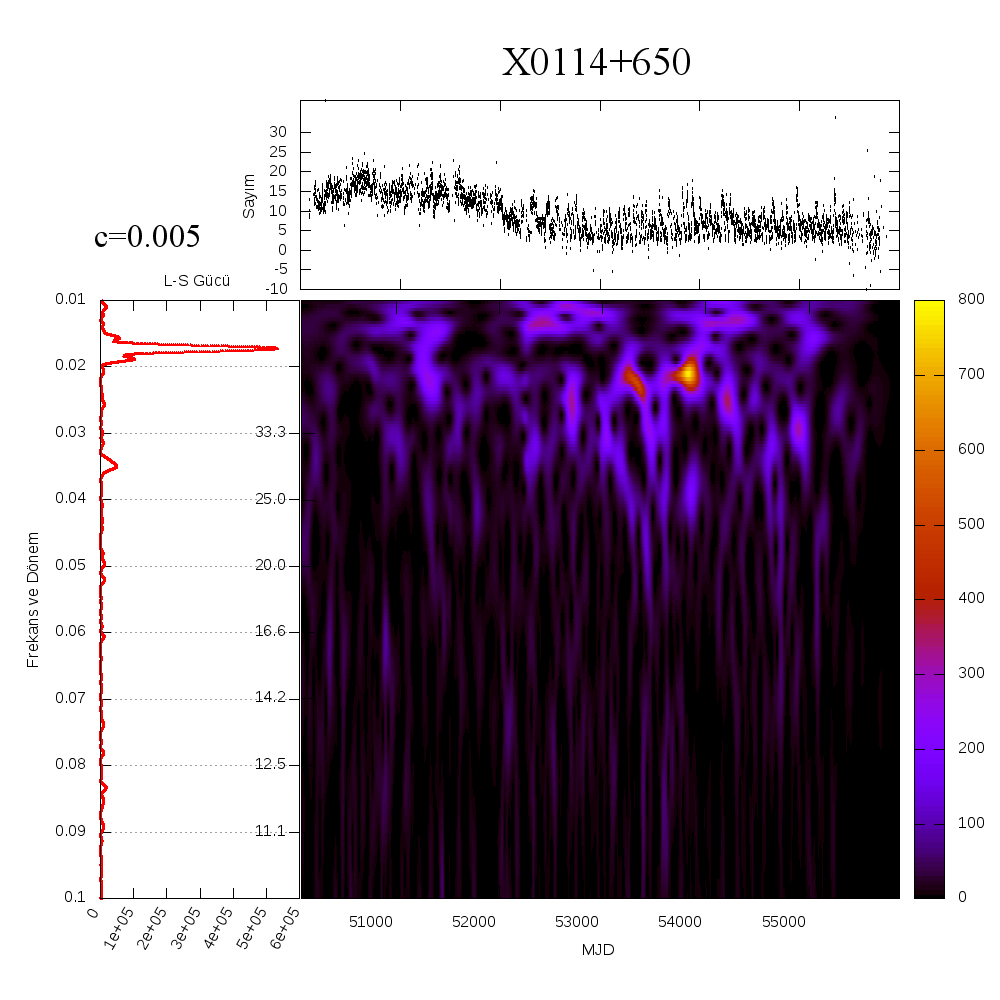

# WWZ Transform Code for Python

This is a Python code for timeseries analysis using WWZ transformations. It uses Foster's abbreviated Morlet Wavelet to analyse timeseries using a WWZ (Weighted Wavelet-Z) transform. (Foster, G., 1996, http://adsabs.harvard.edu/full/1996AJ....112.1709F)

The algoritm is mostly translated from Templeton's Fortran code (Templeton, M., 2004, http://adsabs.harvard.edu/full/2004JAVSO..32...41T).

It can either be used as a module import in another Python script or used as a standalone program. It supports paralellization, yet only in standalone mode.

Dependencies: Python 2.6+ (not Python 3 ready) and NumPy

There is also a Lomb-Scargle script in the repo for ease of use and comparison.

Below is an example of the X-Ray source (observed by the [RXTE](https://heasarc.gsfc.nasa.gov/docs/xte/xte_1st.html) Satellite) with data, Lomb-Scargle and WWZ output.

